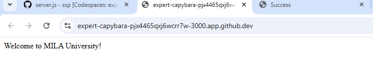
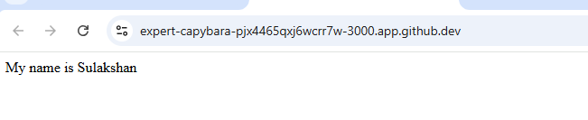
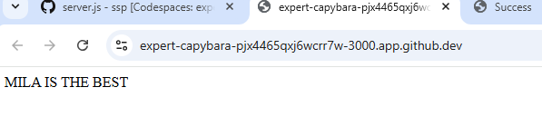

<h1>lab 1: Cloud Environment Setup</h1>
In this lab on cloud environment setup, I learned how to create and configure a basic cloud workspace by setting up virtual machines, managing storage, and configuring network settings. I also gained an understanding of how cloud platforms provide scalable resources on demand, allowing users to deploy and manage applications efficiently without relying on physical hardware. Additionally, I became familiar with essential concepts such as user access control, security configurations, and the overall workflow of initializing and managing a cloud-based environment.

<b>OUTPUT 1</b>

<b>OUTPUT 2</b>

<b>OUTPUT 3</b>

