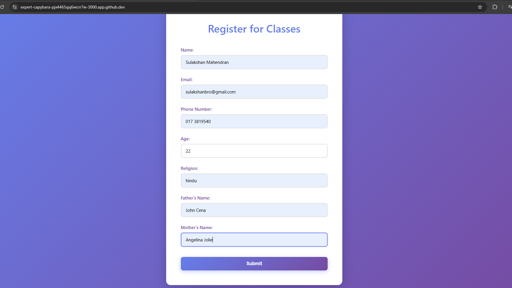
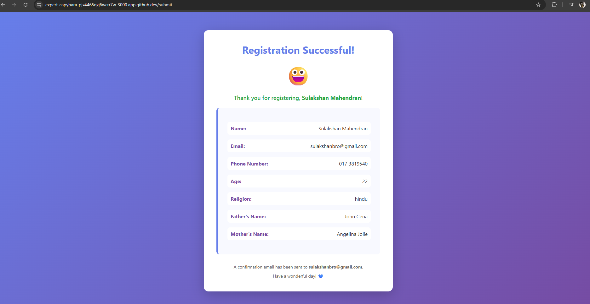

Name: Sulakshan
id:1106232003

<h1>lab 1: Cloud Environment Setup</h1>
In this lab on cloud environment setup, I learned how to create and configure a basic cloud workspace by setting up virtual machines, managing storage, and configuring network settings. I also gained an understanding of how cloud platforms provide scalable resources on demand, allowing users to deploy and manage applications efficiently without relying on physical hardware. Additionally, I became familiar with essential concepts such as user access control, security configurations, and the overall workflow of initializing and managing a cloud-based environment.

<b>OUTPUT 1</b>

<b>OUTPUT 2</b>

<b>OUTPUT 3</b>

<h1>lab 2: EJS and HTML form</h1>
In Lab 2, I learned how to create web forms using **HTML** and connect them with **EJS (Embedded JavaScript)** to handle user input dynamically. I understood how to design form elements such as text fields, buttons, and input validation using HTML, and how EJS helps display dynamic data on web pages by embedding JavaScript inside HTML templates. This lab helped me understand the interaction between frontend user input and server-side rendering, as well as how data submitted through forms can be processed and displayed back to the user. Overall, the lab improved my understanding of building interactive and dynamic web applications.

<b>OUTPUT 1</b>

<b>OUTPUT 2</b>

